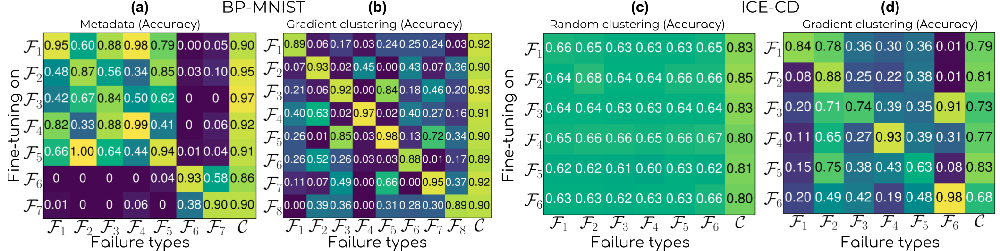
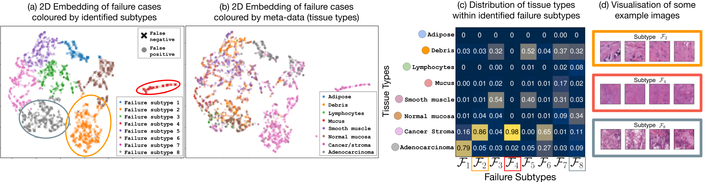

# A Principled Approach to Failure Analysis and Model Repairment: Demonstration in Medical Imaging

[](LICENSE)


This repository contains the implementation of the framework and experiments described in "A Principled Approach to Failure Analysis and Model Repairment: Demonstration in Medical Imaging" published at [MICCAI2021](https://miccai2021.org/en/default.asp).

**Authors**: Thomas Henn, Yasukazu Sakamoto, Clément Jacquet, Shunsuke Yoshizawa, Masamichi Andou, Stephen Tchen, Ryosuke Saga, Hiroyuki Ishihara, Katsuhiko Shimizu, [Yingzhen Li](http://yingzhenli.net/home/en/), and [Ryutaro Tanno](https://rt416.github.io/).

**Contact**: [thomas.henn@lab6.co.jp](mailto:thomas.henn@lab6.co.jp) or [yasukazu_sakamoto@terumo.co.jp](mailto:yasukazu_sakamoto@terumo.co.jp).


This code was written by Thomas Henn at Rokken, Osaka in collaboration with Terumo, Tokyo.

I would especially like to thank [Ryutaro Tanno](https://rt416.github.io/)  at University College London, UK for his valuable contributions to this paper.
In addition, I would like to thank Masamichi Andou for the creation of the catheter detection ground-truth and the extensive detailed labelling of the failure cases.

For more information, please check our paper published at [MICCAI2021](https://link.springer.com/chapter/10.1007%2F978-3-030-87199-4_48) or on [arXiv](https://arxiv.org/abs/2109.12347).






# Installation

* Clone this repo and install the dependencies:

```bash
# Clone this repo (take care of cloning the submodule too)
git clone --recurse-submodules  git@github.com:Rokken-lab6/Failure-Analysis-and-Model-Repairment.git

# (recommended) Create a virtual environment (e.g., with Virtualenv)
cd Failure-Analysis-and-Model-Repairment
virtualenv -p python3.8 venv

# Install the dependencies as described in the requirements.txt file
source venv/bin/activate
pip install -r requirements.txt
```

* Get the dataset and cached experiments

1. Download **pathmnist.npz** into *dataset/data/* from the [MedMNIST website](https://medmnist.com/).
2. Download the cached experiments [here](https://drive.google.com/file/d/1gU13hKerzo_ieMHOAb8rrPt6k8i-m93D/view?usp=sharing) and extract at the base of this repo (all inside a "cached" folder).

# Usage

## Train the model

```bash
python train.py --nowandb -m configs/model/bp_mnist_model.yml
```

## Running the framework (e.g., for gradient clustering)

```bash
python -m model_repair.run -c configs/framework/identification_experiments/grads.yml
```

### Configuration and caching system

This code is a pipeline of tasks (see model_repair/run.py) which are all cached depending on their configuration: the result of tasks with common parameters can be reused accross configuration files.

The different configuration files used in the paper can be found in the "configs" folder.

When the pipeline has finished running, the results are copied into the *out/report* folder.

### Results (inside the out/report folder)

The fine-tuning matrices can be found in "plot_heatmaps", *Indepedence* and *Learnability* metrics can be found in "compute_cluster_metrics_bounded" and the per-cluster statistics in "cluster_stats".
The model repairment results can also be read from the "plot_heatmaps" folder depending on the configuration file used.


# Citation
If you use this code for your research, please cite our [MICCAI 2021](https://miccai2021.org/en/default.asp) [paper](https://link.springer.com/chapter/10.1007%2F978-3-030-87199-4_48):

```
@InProceedings{FailureAnalysisAndRepair21,
title="A Principled Approach to Failure Analysis and Model Repairment: Demonstration in Medical Imaging",
author="Henn, Thomas and Sakamoto, Yasukazu and Jacquet, Cl{\'e}ment and Yoshizawa, Shunsuke and Andou, Masamichi and Tchen, Stephen and Saga, Ryosuke and Ishihara, Hiroyuki and Shimizu, Katsuhiko and Li, Yingzhen and Tanno, Ryutaro",
booktitle="Medical Image Computing and Computer Assisted Intervention -- MICCAI 2021",
year="2021",
publisher="Springer International Publishing",
address="Cham",
pages="509--518",
}
```